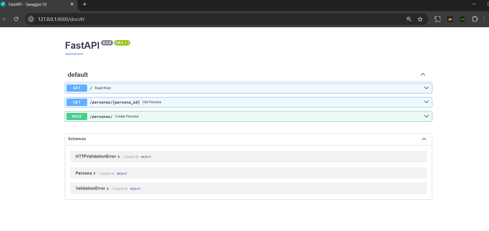
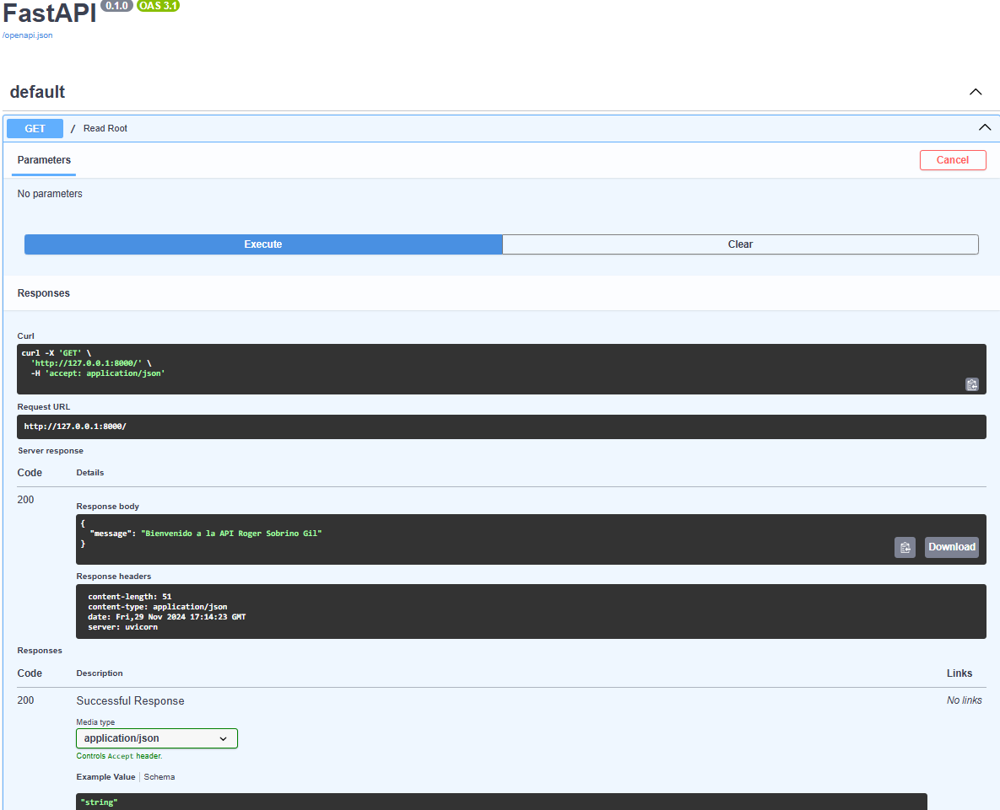
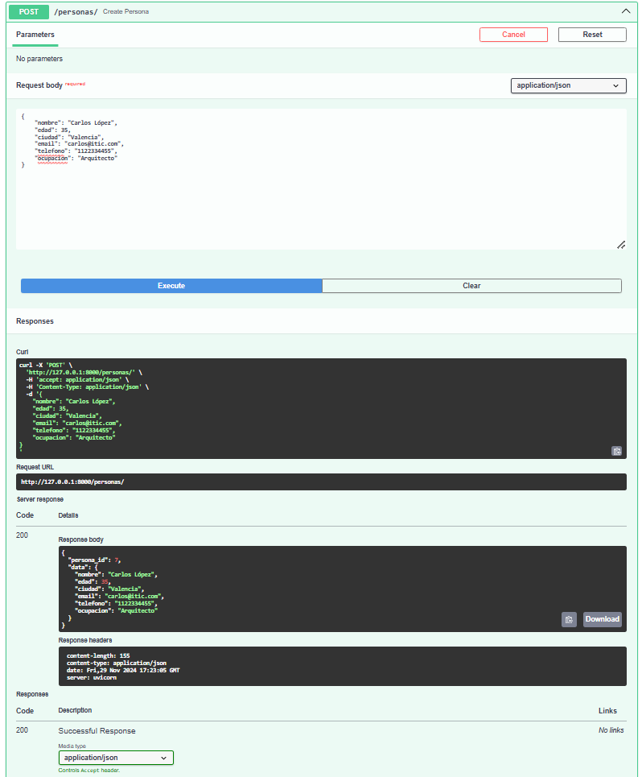
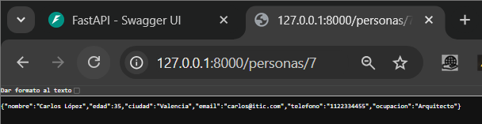
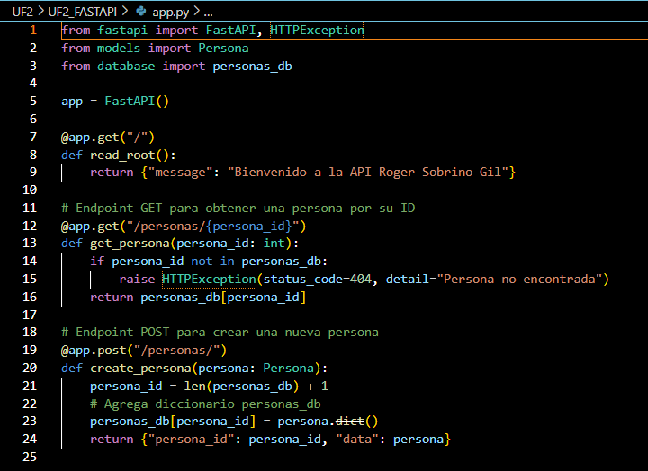
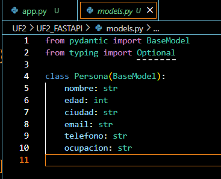
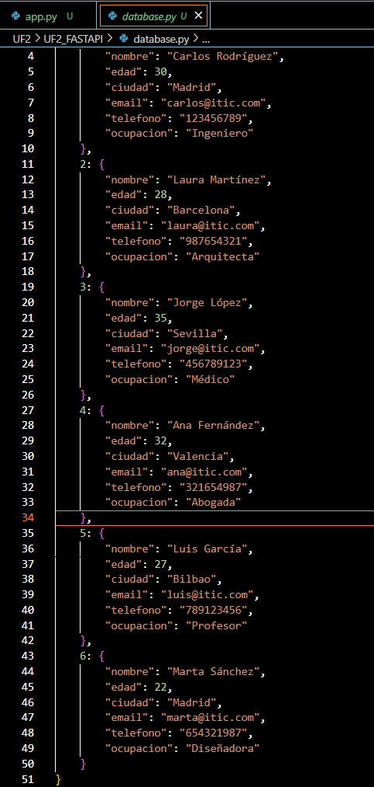

# UF2_FastAPI 

## Estructura del Proyecto
El proyecto está compuesto por los siguientes archivos y carpetas:

app.py: Contiene la configuración de la API FastAPI y los endpoints que permiten realizar las operaciones CRUD sobre las personas.
models.py: Define el modelo `Persona` utilizando Pydantic, que se usa para la validación de los datos recibidos en las solicitudes.
database.py: Contiene un diccionario simulado que actúa como base de datos para almacenar la información de las personas.

## Endpoints

## GET / - Bienvenida
    Descripción: Este endpoint devuelve un mensaje de bienvenida al acceder a la raíz de la API.

## GET /personas/{persona_id} - Obtener persona por ID
    Descripción: Este endpoint permite obtener la información de una persona específica utilizando su ID. Si no se encuentra a la persona, se retorna un error 404.

## POST /personas/ - Crear una nueva persona
    Descripción: Permite agregar una nueva persona a la base de datos. El cuerpo de la solicitud debe incluir los datos de la persona (como nombre, apellido, edad, etc.).
Archivos

## app.py
  Contiene la lógica de la API con FastAPI. Aquí se definen los tres endpoints mencionados:
  GET /: Devuelve un mensaje de bienvenida.
  GET /personas/{persona_id}: Devuelve la información de una persona específica.
  POST /personas/: Crea y agrega una nueva persona a la base de datos.

## models.py
  Define el modelo Persona utilizando Pydantic para validar los datos. El modelo incluye:

## database.py
Simula una base de datos utilizando un diccionario personas_db, donde cada persona está guardada con un ID único.

